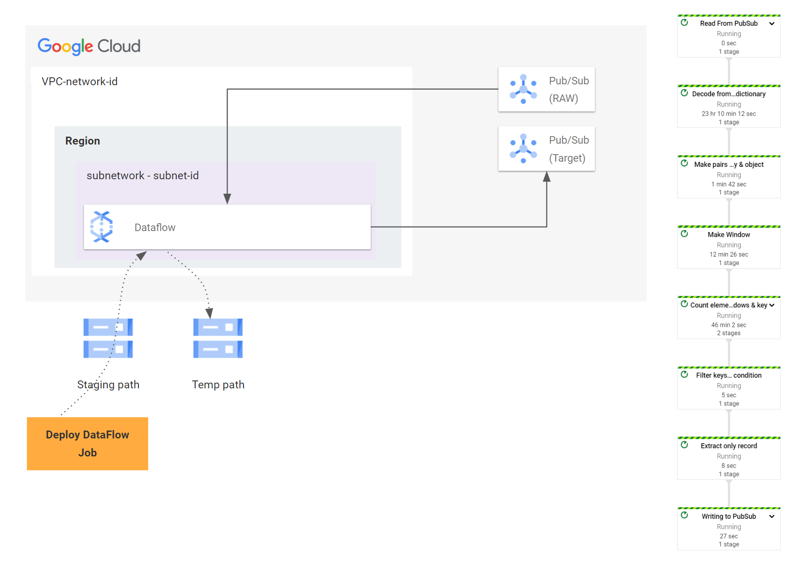

# dataflow-demo

In this demo, you can do the following things. 

  1. Creating DataFlow workers in the specified network / subnetwork. 
  2. Creating DataFlow Task which can handle the count of the metric

## Prerequsites

Before to use DataFlow script, you should confgiure your settings in your environment variables.

Create a environment file(ex. environ.env) in the 'src' folder with the following contents.

    export project_id='<<project_id>>'  # ex. 'sample-204928'
    export source_topic_id='<<source topic id>>'  # ex. 'raw_queue'
    export dest_topic_id='<<target topic id>>'  # ex. 'anomaly_detected_queue'
    export region='<<region>>' # ex. 'asia-northeast3'
    export job_id='<<job id>>'  # ex. 'job_asia3_test1'
    export network='<<network id - vpc>>'   # ex. 'mycompany-network'
    export subnetwork='<<subnetwork id - vpc>>'   # ex. 'subnet-korea-network'
    export cred='/home/postgres/turnkey_sample.json'    # ex. '/my/service/account/credential/file/path'. If you want to use default service account in Notebook instance, empty it.
    export key_attrib='<<group by key>>'  # ex. 'device_id'. This key will be used in the aggregation key in the pipeline. In your raw data, this key MUST exist.
    export threshold_value=<<threshold value>>     # ex. 'threshold value' will be use in the filter. If the number of count is bigger than 'threshold_value', this record will be delivered 'target' topic.
    export up_threshold_yn=<<bigger or lower>>   # ex. 'True/False', If this value is set to 'True', comparison operator is 'bigger', else, comparison operator is 'lower'
    export window_interval=<<window period>>   # ex. '30'. This value indicates the term of window. Unit is second
    export repeat_interval=<<repeat trigger interval>>    # ex. 0/10/20. This value indicates the window trigger interval. If this value is zero, window algorithm wiil be use 'Tumbling window', else, window algorithm will use 'Sliding Window'.
    export temp_location=<<temporary GCS path>> # ex. 'gs://dataflow-asia-northeast3-xxx/temp/' . This folder is used as a temporary offset stored.
    export staging_location=<<staging GCS path>> # ex. 'gs://dataflow-asia-northeast3-xxx/staging/'. This folder is used to store package/pipeline environments.

## Diagram

You can see the overview of this DataFlow Demo. 

## How to deploy 

If you want to use in notebook, use 'pubsub_count_detection.ipynb'. In some environments, Organization policy can prevent to deploy DataFlow instance via notebook instance. 
In that case, you can use 'pubsub_count_detection.py' file with service account key.

### 1. On notebook instance

1. clone this project in your notebook. Use [git]-[cloe] menu.
2. Configure your environment variables in 'src/environ.env' file. (If your notebook has right permission, you don't need to set 'cred' attribute in the configuration file)
3. Run all script

### 2. On shell command

1. Clone this project in your command shell. 
2. Make
2. Check service account credential file exists in your shell.
3. Configure your environment variables in 'src/environ.env' file. (If your notebook has right permission, you don't need to set 'cred' attribute in the configuration file)
4. Run the script.

For example, the following script can be convered above steps. 

    git clone https://github.com/kpyopark/dataflow-demo.git
    cd dataflow-demo
    python -m venv .
    source bin/activate
    pip install -r requirements.txt
    vi src/environ.env  ## Modify values in the configuration file.
    source src/environ.env
    python src/pubsub_count_detection.py

